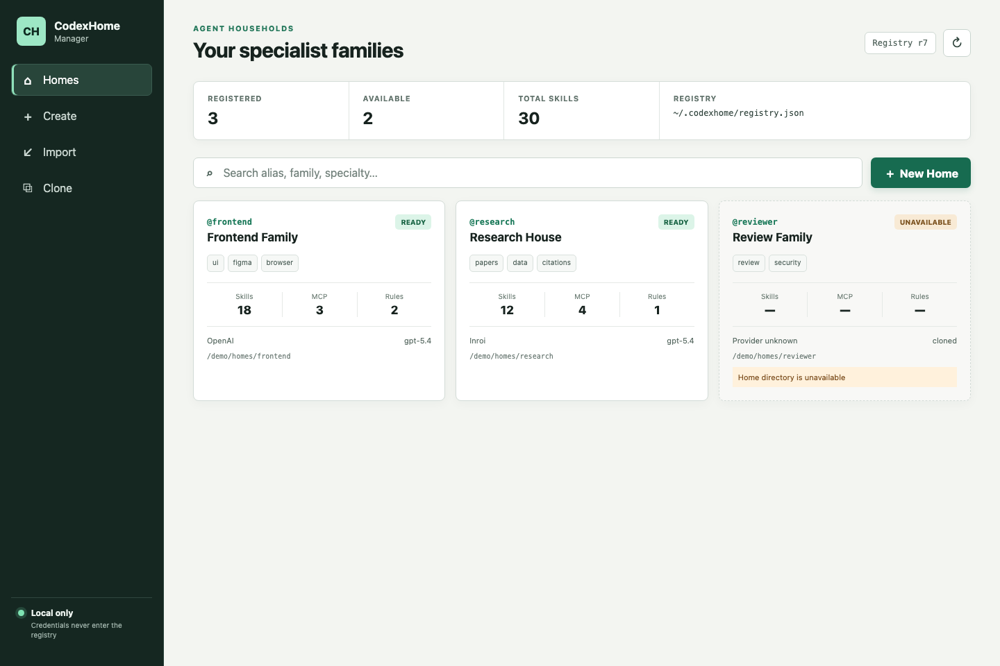

# CodexHome Manager

[](https://github.com/harzva/codexhome-manager/actions/workflows/ci.yml)
[](LICENSE)
[](RELEASE_NOTES.md)

**One machine, many specialist Codex families.**

CodexHome Manager helps Codex power users discover, separate, label, clone, and manage multiple `CODEX_HOME` directories as isolated Skill Spaces and specialized Agent Households.

> Status: v0.2 alpha. Discovery, registry aliases, safe Home lifecycle commands, append-only observability, durable Agent Run projections, and the connected Desktop UI work. Process execution, policy routing, Skill placement, and MCP routing remain roadmap work.

## Why

A single Codex Home can accumulate too many Skills, MCP servers, Rules, Hooks, providers, and sessions. CodexHome Manager keeps these capabilities separated:

```text
Main Home
├─ @frontend  UI Skills + browser/Figma MCP
├─ @research  research and data Skills
├─ @reviewer  read-only review Skills
└─ @ops       CI and release Skills
```

The main Home can stay small and delegate work to a specialized Home when needed.

## Current capabilities

- Discover the default and explicitly configured `CODEX_HOME` directories.
- Discover common launcher-managed Homes on macOS.
- Inspect an allowlisted set of safe configuration fields.
- Count Skills, MCP servers, enabled features, Rules, and Hooks.
- Report whether auth/config files exist without reading credential contents.
- Produce human-readable or stable JSON output.
- Diagnose missing auth, missing config, and inspection warnings.
- Persist unique `@alias` values, family labels, and Unicode specialty tags.
- Create new Homes, import existing Homes, and safely clone registered Homes.
- Preview every lifecycle mutation with `--dry-run`.
- Record append-only task/run/attempt/thread observability events.
- Aggregate token, cache, duration, retry, failure, cost, and Home health metrics.
- Export filtered observability events as versioned JSON or analysis-ready CSV.
- Create durable Tasks and Agent Runs without storing prompts or model responses.
- Track retries and Home/model migrations under one `run_id`.
- Enforce token, duration, cost, and attempt budgets before starting another attempt.
- Attribute failed-attempt cost separately from successful work.
- Link threads, tool calls, opaque artifacts, verification evidence, and final artifacts.

## Five-minute quickstart

Requirements:

- Rust 1.85 or newer.
- A local Codex installation is optional for discovery tests.

```bash
git clone https://github.com/harzva/codexhome-manager.git
cd codexhome-manager
cargo install --path crates/codexhome-cli
codexhome scan
```

Register one discovered Home without changing it:

```bash
codexhome home import /absolute/path/to/home \
  --alias @research \
  --label "Research Family" \
  --specialty papers \
  --dry-run
```

The dry-run prints the exact registry action and warnings. Repeat without `--dry-run` only after reviewing the plan.

## Commands

```bash
codexhome scan
codexhome scan --json
codexhome inspect <id-or-label-or-path>
codexhome doctor
codexhome doctor --json
codexhome registry list
codexhome registry show @frontend
codexhome registry path
codexhome home create @frontend --path /path/to/frontend --specialty ui
codexhome home import /path/to/research --alias @research --specialty papers
codexhome home clone @frontend @reviewer --path /path/to/reviewer --dry-run
codexhome observe record events.jsonl
codexhome observe summary --home-id @research --json
codexhome observe verify
codexhome observe export --format csv --output events.csv
codexhome task create --label "Compile benchmark" --kind coding
codexhome run start <task-id> --max-total-tokens 300000 --max-duration-ms 5400000
codexhome run attempt start <run-id> --home-id home-main --model gpt-5.5
codexhome run show <run-id> --json
```

Clone Skills, Rules, and Hooks only after reviewing the source Home:

```bash
codexhome home clone @frontend @frontend-copy \
  --path /path/to/frontend-copy \
  --copy-capabilities \
  --dry-run
```

Add extra Home candidates without changing your shell's active `CODEX_HOME`:

```bash
codexhome --home /path/to/another-home scan
```

Or use a platform path list:

```bash
CODEXHOME_PATHS="/path/one:/path/two" codexhome scan
```

Precedence and discovery order:

1. Default `~/.codex`.
2. Current `CODEX_HOME`.
3. Repeated `--home` arguments.
4. `CODEXHOME_PATHS`.
5. Known launcher-managed locations for the current platform.

Registry path precedence is `--registry`, then `CODEXHOME_REGISTRY`, then `~/.codexhome/registry.json`. See [docs/registry.md](docs/registry.md).

## JSON contract

`--json` writes only JSON to stdout. Progress and diagnostics must never corrupt the JSON stream. Reports exclude credential values but include local Home paths and provider hostnames, so review them before sharing publicly.

The discovery schema is `codexhome.discovery.v1`; v0.2 adds `codexhome.registry.v1`, `codexhome.registry-report.v1`, `codexhome.home-mutation.v1`, the strict `codexhome.observability-event.v1` / `codexhome.observability-summary.v1` contracts, and `codexhome.agent-runs.v1` / `codexhome.agent-run-mutation.v1`.

The Agent Run state is projected from the same append-only observability stream, so cost analysis and lifecycle state cannot silently drift. The stream excludes prompts, responses, credential values, arbitrary payloads, raw tool arguments, and artifact paths. See [docs/observability.md](docs/observability.md) and [docs/agent-runs.md](docs/agent-runs.md).

## Security

CodexHome Manager never reads the contents of `auth.json`. It parses `config.toml` locally, retains only allowlisted non-secret fields in its report, and reduces provider URLs to hostnames.

Third-party provider execution, Skill installation, MCP changes, Hooks, and child-agent delegation will require explicit policy and confirmation in later milestones.

See [SECURITY.md](SECURITY.md) and [ROADMAP.md](ROADMAP.md).

The core trust boundaries and planned Household execution model are described in [docs/architecture.md](docs/architecture.md). The stable adapter boundary used by the desktop UI is in [docs/desktop-api.md](docs/desktop-api.md).

## Desktop UI

The Tauri desktop adapter lives in `apps/desktop` and calls `codexhome-core` directly. It provides Home cards, visible inactive/error states, alias and specialty search, and dry-run-first Create/Import/Clone forms.



Preview source: [apps/desktop/src/main.ts](apps/desktop/src/main.ts) and [apps/desktop/src/styles.css](apps/desktop/src/styles.css).

```bash
cd apps/desktop
npm install
npm run tauri dev
```

For frontend-only development, use `npm run dev`. See [docs/troubleshooting.md](docs/troubleshooting.md) when platform or dependency setup fails.

## Documentation

- [Architecture and trust boundaries](docs/architecture.md)
- [Registry format and lifecycle semantics](docs/registry.md)
- [Desktop adapter contract](docs/desktop-api.md)
- [Observability event and metric contract](docs/observability.md)
- [Agent Run lifecycle and recovery contract](docs/agent-runs.md)
- [Troubleshooting](docs/troubleshooting.md)
- [Product readiness audit](docs/product-readiness-v0.2.md)
- [Security and privacy audit](docs/security-audit-v0.2.md)
- [Roadmap](ROADMAP.md)
- [Release notes](RELEASE_NOTES.md)

## Contributing and support

Read [CONTRIBUTING.md](CONTRIBUTING.md) before opening a pull request and [SUPPORT.md](SUPPORT.md) before filing an issue. Report vulnerabilities privately as described in [SECURITY.md](SECURITY.md).

## Name and trademark

The repository and CLI use the descriptive name CodexHome Manager. This is an independent community project and is not affiliated with or endorsed by OpenAI. Codex is a trademark of its respective owner.

## License

MIT
